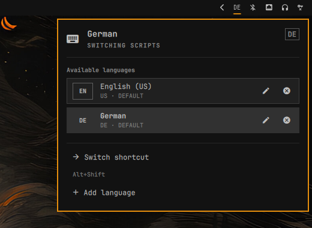
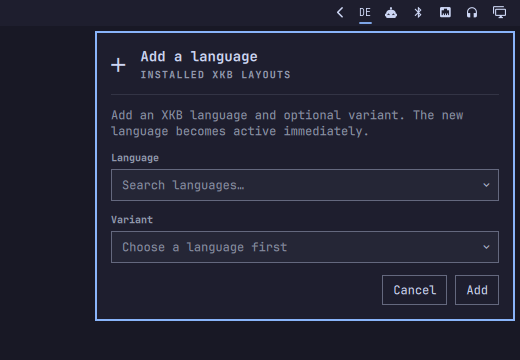
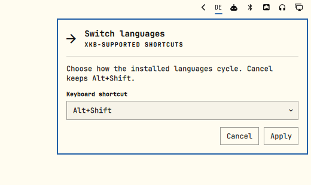
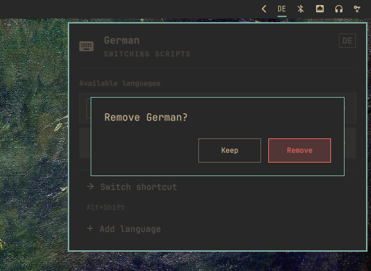

# Keyboard Languages for Omarchy

[](https://github.com/NOmarkOO/omarchy-keyboard-languages/releases/latest)
[](https://github.com/NOmarkOO/omarchy-keyboard-languages/actions/workflows/ci.yml)
[](LICENSE)

A two-letter keyboard-language indicator and complete XKB layout manager for the Omarchy Quattro bar.



Left-click the bar label to switch language. Right-click it to manage layouts, add variants, remove layouts safely, or change the switching shortcut.

> [!NOTE]
> This is an independent community plugin. It is not an official Omarchy or Basecamp project and is not supported by them.

## Install

Run this exact-SHA command from a terminal inside your Omarchy desktop session:

```bash
curl -fsSL https://raw.githubusercontent.com/NOmarkOO/omarchy-keyboard-languages/8d069859f40b6ec15db73b5b9397dca8f9d19614/install.sh |
  bash -s -- --commit 8d069859f40b6ec15db73b5b9397dca8f9d19614
```

The downloaded installer and installed plugin are both pinned to the same immutable v1.0.1 commit.

The installer imports your current layouts, variants, group shortcut, and other XKB options. It replaces the stock keyboard indicator, places itself immediately before the tray, and restarts only `omarchy-shell`. It never reloads Hyprland.

Prefer to inspect scripts before running them?

```bash
commit=8d069859f40b6ec15db73b5b9397dca8f9d19614
git clone --no-checkout https://github.com/NOmarkOO/omarchy-keyboard-languages.git
cd omarchy-keyboard-languages
git checkout --detach "$commit"
less install.sh
./install.sh --commit "$commit"
```

The installer is idempotent. It also migrates the earlier copied `nomarkoo.keyboard-layout` installation to a normal Git-managed Omarchy plugin and keeps a recoverable backup.

## What it does

- Shows the active layout as a compact two-letter bar label.
- Switches to the next configured layout on left-click.
- Opens a keyboard-first, screen-aware manager on right-click.
- Discovers installed XKB layouts, variants, and valid group shortcuts.
- Keeps a Latin layout first so Quattro's `SUPER` + letter bindings remain usable.
- Prevents deletion of the last remaining layout.
- Preserves Compose and other non-group XKB options.
- Applies changes through targeted Hyprland IPC with rollback—no compositor reload and no session interruption.
- Fits top, bottom, left, and right bars, including multi-monitor setups.
- Inherits every active Quattro theme automatically.

## Native by construction

This plugin is intentionally extremely close to first-party Quattro modules in both appearance and behavior. It directly composes the shell's shared `WidgetButton`, `KeyboardPanel`, `PanelHero`, `PanelKeyCatcher`, `Button`, `BorderSurface`, `CursorSurface`, and `ConfirmDialog` primitives. Spacing, typography, borders, focus, color, anchoring, and popup behavior come from `qs.Ui` and `qs.Commons`, not a parallel visual imitation.

It remains a third-party plugin because it is distributed outside the Omarchy repository. Quattro's public interfaces can evolve, so each release is tested against the current Quattro branch.

## Across Quattro themes

| Matte Black · manager | Catppuccin · add language |
| --- | --- |
|  |  |
| Flexoki Light · shortcut | Gruvbox · remove confirmation |
|  |  |

## Requirements

- Omarchy Quattro 4.0 or newer.
- A live Hyprland session for first installation.
- `git`, `jq`, `xkbcli`, and the standard Omarchy plugin commands.

These dependencies are present on a standard Quattro system. The first install deliberately stops without changing anything if it cannot read either existing plugin state or the live keyboard configuration.

## Update

Use the exact-SHA command from the newest [GitHub release](https://github.com/NOmarkOO/omarchy-keyboard-languages/releases/latest). For v1.0.1, rerun:

```bash
curl -fsSL https://raw.githubusercontent.com/NOmarkOO/omarchy-keyboard-languages/8d069859f40b6ec15db73b5b9397dca8f9d19614/install.sh |
  bash -s -- --commit 8d069859f40b6ec15db73b5b9397dca8f9d19614
```

It updates the existing checkout only after fetching and verifying that reviewed commit. Local edits inside the installed plugin are never overwritten.

Omarchy's native plugin updater follows mutable upstream `HEAD`; that is useful for testing current development but is not bound to the Marketplace-reviewed release snapshot.

## Remove

From the installed plugin directory:

```bash
~/.config/omarchy/plugins/nomarkoo.keyboard-layout/uninstall.sh
```

This restores the stock keyboard indicator, backs up the plugin checkout, and preserves the current keyboard configuration. To remove the plugin-owned state too, log out of Hyprland first and run the backed-up script with `--purge-state`. Purging is refused inside a live session because removing an active keyboard override can trigger unsafe compositor reconfiguration.

## Configuration and recovery

Mutable data stays outside the Git checkout:

```text
~/.local/state/omarchy/settings/nomarkoo-keyboard-layout.json
~/.local/state/omarchy/toggles/hypr/nomarkoo-keyboard-layout.lua
```

The JSON document is the source of truth; the Lua file is generated for Omarchy's user-toggle loader. The installer creates timestamped `shell.json` backups and keeps its first-install snapshot under:

```text
~/.local/state/omarchy/settings/nomarkoo-keyboard-layout-install-backup/
```

If the panel cannot start, restore the newest `~/.config/omarchy/shell.json.bak.*` and run `omarchy restart shell`. Open a [bug report](https://github.com/NOmarkOO/omarchy-keyboard-languages/issues/new?template=bug.yml) with your Omarchy and Hyprland versions if the problem continues.

## Security

Omarchy plugins execute unsandboxed QML and processes inside the long-lived shell. Review code before enabling any plugin; the [official Omarchy plugin manual](https://github.com/basecamp/omarchy/blob/quattro/manual/32-shell-plugins.md) gives the same warning.

This plugin performs no telemetry and makes no runtime network requests. The installer requires a full commit SHA, checks out that exact commit in detached mode before executing repository helpers, writes only user-owned Omarchy configuration/state paths, and invokes one `omarchy restart shell`. It requires no elevated privileges, edits no packaged Omarchy files, and never reloads Hyprland.

## Development

```bash
./test.sh
```

The suite validates the manifest and QML, parses the live XKB catalog, exercises add/remove/shortcut rollback with a fake Hyprland endpoint, and tests clean install, copied-plugin migration, idempotency, origin conflicts, offline refusal, activation rollback, and uninstall recovery.

See [CONTRIBUTING.md](CONTRIBUTING.md) and [docs/architecture.md](docs/architecture.md) for the release and runtime design.

## License and attribution

Released under the [MIT License](LICENSE). Omarchy is an independent MIT-licensed project by Basecamp; its name and project links are used only to identify compatibility. See the [Omarchy repository](https://github.com/basecamp/omarchy).
